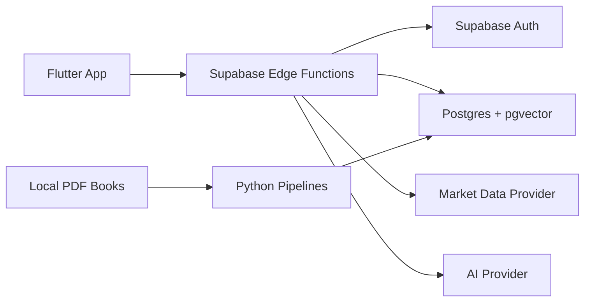

# Architecture

Dokumen ini menjelaskan rancangan awal `stock-ai-advisor`.

## Ringkasan

Sistem terdiri dari empat area utama:

- Flutter client untuk pengalaman pengguna.
- Supabase sebagai backend utama, auth, database, pgvector, dan Edge Functions.
- Python tooling untuk preprocessing buku, indikator, dan backtesting.
- AI provider untuk ekstraksi teori dan explanation yang terkontrol.

Flutter tidak menyimpan secret dan tidak menjalankan logic sensitif. Client hanya berinteraksi dengan endpoint backend yang sudah menerapkan rule engine, validasi, audit, dan batasan akses.

## High-Level Flow

## Komponen

### Flutter App

Tanggung jawab:

- Login dan session handling via Supabase Auth.
- Menampilkan dashboard saham, watchlist candidate, entry candidate, chart, dan explanation.
- Mengirim request analisis ke Supabase Edge Functions.
- Menampilkan loading, empty, dan error state.

Batasan:

- Tidak menyimpan API key market data.
- Tidak menyimpan API key AI provider.
- Tidak menentukan status kelayakan saham secara mandiri.
- Tidak menjalankan rule engine sensitif.

### Supabase Edge Functions

Tanggung jawab:

- Endpoint scoring realtime.
- Endpoint explanation berbasis hasil rule engine dan konteks RAG.
- Proxy aman ke market data provider.
- Pemanggilan AI provider dengan prompt terkendali.
- Audit log untuk input, versi rule, hasil scoring, dan explanation.

Contoh endpoint yang direncanakan:

- `score-symbol`: menghitung skor dan status kandidat.
- `explain-score`: menjelaskan hasil analisis berdasarkan skor dan konteks teori.
- `refresh-market-data`: mengambil dan menyimpan data market terbaru.
- `run-backtest-summary`: mengambil ringkasan hasil backtesting yang sudah dihitung.

### Supabase Postgres

Tabel awal yang direncanakan:

- `profiles`: profil user.
- `symbols`: master saham.
- `market_snapshots`: snapshot harga dan indikator ringkas.
- `analysis_rules`: versi rule engine.
- `score_runs`: hasil scoring.
- `watchlist_candidates`: daftar saham layak dianalisis.
- `book_sources`: metadata buku.
- `book_chunks`: chunk teori dan embedding pgvector.
- `backtest_runs`: metadata backtesting.
- `backtest_results`: hasil backtesting per strategi/periode.

Gunakan Row Level Security untuk data user dan service role hanya di backend.

### RAG Buku

Pipeline:

1. Simpan PDF lokal di `data/books/`.
2. Ekstrak teks dengan Python.
3. Bersihkan teks dan bagi menjadi chunk.
4. Buat embedding.
5. Simpan chunk, metadata, dan vector ke Supabase pgvector.
6. Saat explanation diminta, backend mengambil konteks teori yang relevan.
7. AI provider menyusun explanation berdasarkan hasil rule engine dan konteks tersebut.

AI tidak boleh mengubah hasil scoring atau memberi keputusan bebas.

### Rule Engine

Rule engine menghasilkan label analisis seperti:

- `not_screened`
- `needs_more_data`
- `watchlist_candidate`
- `entry_candidate`
- `risk_flagged`

Label ini bukan instruksi transaksi. Rule engine harus versioned agar hasil lama dapat diaudit.

### Backtesting

Backtesting dijalankan di Python untuk eksperimen offline dan ringkasan hasilnya disimpan ke Supabase.

Minimal metadata backtesting:

- strategi
- versi rule
- universe saham
- periode
- timeframe
- asumsi biaya
- metrik performa
- keterbatasan

## Boundary Keamanan

- Flutter menggunakan anon key Supabase sesuai praktik normal, tetapi tidak menggunakan service role key.
- Market data API key hanya berada di Edge Functions atau environment backend.
- AI provider key hanya berada di Edge Functions atau environment backend.
- PDF buku dan dataset lokal tidak masuk Git.
- Prompt internal, raw retrieved chunks bila sensitif, dan secret tidak dikirim ke client.

## Data Privacy dan Audit

Setiap scoring perlu menyimpan:

- timestamp
- symbol
- user id bila relevan
- input data version
- rule version
- output score
- label kandidat
- explanation id

Audit log membantu debugging, evaluasi akademik, dan reproduksi hasil.
